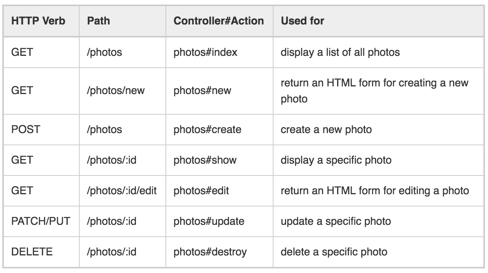

## Ruby On Rails

### Routing
El objetivo de todos los frameworks de desarrollo Web, incluido Rails, es el de
mapear (o relacionar) URL’s (p.e. http://localhost:3000/productos) al código que
va a procesar esas peticiones. - http://blog.makeitreal.camp/introduccion-ruby-on-rails/

#### Recursos en la web

* Single
    
    ```
    get '/patients/:id', to: 'patients#show'
    ```
    produce: http://localhost/patients/17
    
    en el controlador
    
    ```
    @patient = Patient.find(17)
    ```
    en la vista
    ```
    <%= link_to 'Patient Record', patient_path(@patient) %>
    ```

* Resources

    El enrutamiento de recursos le permite declarar rápidamente todas las rutas
    comunes para un controlador de recursos. En lugar de declarar rutas separadas
    para sus acciones index, show, new, edit, create, update y delete, una ruta de
    recursos las declara en una sola línea de código.
    
    Los navegadores solicitan paginas desde Rails haciendo una solicitud de una URL
    utilizando un metodo, como GET, POST, PATCH, PUT y DELETE. Cada metodo es una solicitud
    para realizar una operacion en el recurso.

* CRUD, verbos y acciones
    En Rails, una ruta de recursos proporciona una correlación entre los verbos HTTP y las URL
    a las acciones del controlador. Por convención, Cada acción también se asigna a una 
    operación CRUD específica en una base de datos. Una sola entrada en el archivo de enrutamiento,
    como:

    ```
    resources :photos
    ```
    
    Crea siete rutas diferentes en su aplicación, todas las asignaciones al controlador de fotos:
    
    

### Planea tu producto

Links 
* http://railsapps.github.io/rails-project-management.html

##### Product owner

El propietario del producto es el defensor del cliente, asegurándose de que el equipo crea valor
para los usuarios.

##### User stories
```
As a <role>
I want <goal>
In order to <benefit>
```
ej:
```
Join Mailing List*
As a visitor to the website
I want to join a mailing list
In order to receive news and announcements
```

### Resources RoR
* Rails http://api.rubyonrails.org/
* Routes http://guides.rubyonrails.org/routing.html


